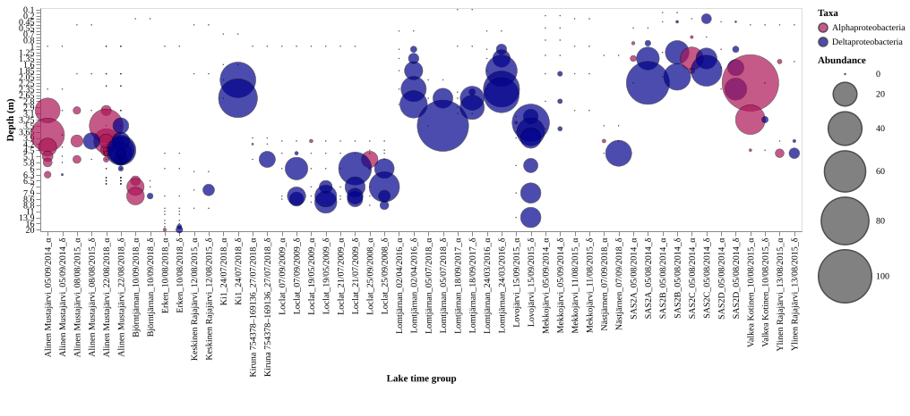
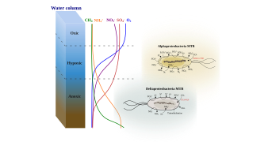

# **MTB Profiling**
This repository contains the codes and scripts used in processing the **metagenomic data** and the downstream **global distribution and abundance data** of magnetotactic bacteria (MTB). The goal of this repository is to enable data sharing and facilitate genomic-based MTB research.

For now (*until 2023/06/29*), one project is included in this repository.

## **Contents**
- [Codes and scripts](#Codes-and-scripts)
- [Usage](#usage)
- [Projects](#Projects)
    - [MTB Profiling in Freshwater Environments of Northern Hemisphere](#MTB-Profiling-in-Freshwater-Environments-of-Northern-Hemisphere)
- [Contact](#contact)

## **Codes and scripts**
**Codes**:

Codes describe the **detailed commands and parameters used for processing metagenomic sequencing data with external bioinformatics tools**.
Codes includ the **quality control** of sequencing data, **reads assembly**, **contigs binning**, **genome quality assessment**, **taxonomic classification**, **phylogeny analysis**, **magnetosome genes annotation**, **metabolic function prediction**, **MTB distribution and abundance profiling**, etc. 

Codes are deposited in **`programs_codes`** folder.

**Scripts**:

Scripts describe the **downstream processing of primary data generated by external bioinformatics tools**. 
Scripts focus on how to perform **data cleaning**, **data transformation**, **data integration**, **statistical analysis** and **publication-ready data graphing**.

Scripts are deposited in **`scripts`** folder.

***Note**: codes and scripts files are named after the projects' name.*

## **Usage**
Codes (`*.txt`) serve as records of projects' metagenomic data analysis and provide references for other future studies. Codes can be directly downloaded and viewed with text editor.

Scripts are `.ipynb` files generated using [JupyterLab](https://jupyter.org/), which contain all data processing codes and related annotation information.
Scripts can be downloaded from `scripts` folder and viewed using jupyterlab or jupyter notbook. All scripts can be **rerunned and reused** for future studies.
## **Projects**
### **MTB Profiling in Freshwater Environments of Northern Hemisphere**
*Brief introduction:* This project profiled MTB distribution and abundance across 38 freshwater lakes and ponds in the northern hemisphere. 267 metagenomes were sampled, sequenced and reported in 2021 by Moritz Buck et al. in [this paper](https://www.nature.com/articles/s41597-021-00910-1). 63 MTB MAGs were obtained. comprehensive analysis were conducted including taxonomic classification, key metabolic pathways reconstruction, distribution and abundance profiling across all samples.

*Key Findings:* MTB belonging to Deltaproteobacteria were found to be the most ubiquitous and abundant MTB group in freshwater lakes and ponds. New MTB-containning phylum (Myxococcota) was brought to light. Lineage-specific metabolic potentials were revealed, and associated niche differentiation was demonstrated. More predatory MTB genomes were found, indicating a potential widely distribution of magnetotaxis among predatory bacteria.

*
Delta-, Alpha-proteobacteria MTB profile across lakes and ponds in the northern hemisphere
*

*
Delta-, Alpha-proteobacteria MTB niche differentiation schematic model
*

---
## **Contact**

Feel free to raise an issue if you have questions.

If you find codes and scripts here useful for your research, please cite our related papers.

Thank you.