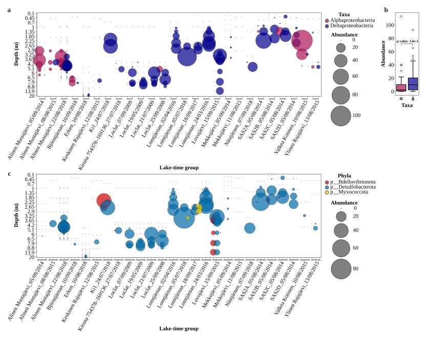
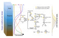

# **MTB Profiling**
This repository contains scripts used in processing the **metagenomic data** for **global distribution and abundance analysis** of magnetotactic bacteria (MTB). This repository aims to provide code availability and support genomic-based research on MTB.

For now (*until 2025/03/14*), one project is included in this repository.

## **Contents**
- [Scripts](#Scripts)
- [Projects](#Projects)
    - [Magnetosome gene cluster containing bacteria in oxygen-stratified freshwater ecosystems of northern landscapes](#Magnetosome-gene-cluster-containing-bacteria-in-oxygen-stratified-freshwater-ecosystems-of-northern-landscapes)
- [Citation](#Citation)

## **Scripts**

Custom codes used in data processing are deposited in **`scripts`** folder.

***Note**: Scripts files are named after the projects' name.*

## **Projects**
### **Magnetosome gene cluster containing bacteria in oxygen-stratified freshwater ecosystems of northern landscapes**
*Brief introduction:* This project profiled MTB distribution and abundance across 38 freshwater lakes and ponds in oxygen-stratified freshwater ecosystems of northern landscapes. 63 MGC-containing MAGs were obtained. Multiple analysis were conducted including taxonomic classification, distribution and abundance profiling and metabolism analysis.

*Key Findings:* MGC-containing *Deltaproteobacteria* were found to be the most ubiquitous and abundant putative MTB group in freshwater lakes and ponds. New MGC-containning phylum (*Myxococcota*) was brought to light. Lineage-specific metabolic potentials were revealed, and associated niche differentiation was demonstrated. MGC-containing genomes belong to phyla *Bdellovibrionota* and *Myxococcota* indicating a potential distribution of magnetotaxis among predatory bacteria.

  

<!--  -->

*
Distribution and abundance profile of MGC-containing Alphaproteobacteria and Deltaproteobacteria across 26 lake-time groups
*

  

<!--  -->

*
Conceptual model of carbon, nitrogen, and sulfur cycling driven by dominant MTB (Deltaproteobacteria and Alphaproteobacteria) members near the oxygen-stratified water column
*

---
## **Citation**

If you find scripts here useful for your research, please cite our related papers.

Thank you.